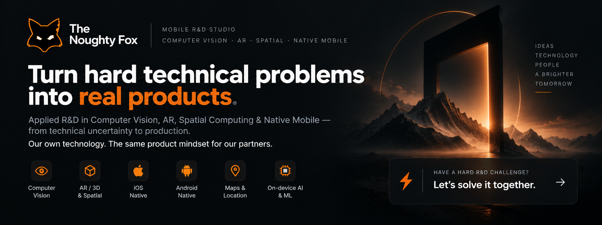

# We build computer vision and AR systems that work on mobile.

**The Noughty Fox** is a mobile R&D studio from Moldova. We specialize in Computer Vision, Augmented Reality, and Spatial Scanning — systems that run on phones, not servers.

We've shipped production-grade CV pipelines, real-time AR features, and 3D spatial capture tools for clients across InsurTech, PropTech, and real estate.

---

## What we work on

**Computer Vision** — object detection, segmentation, edge inference, custom model training for mobile (iOS/Android)

**Augmented Reality** — marker-based and markerless AR, spatial anchoring, real-time overlays

**Spatial Scanning & 3D Capture** — LiDAR-assisted scanning, Gaussian Splatting from video, point cloud processing

**SDK Development** — proprietary mobile SDKs for CV and scanning workflows embedded into client apps

---

## Technologies

---

## Where to find us

---

## Work with us

We take on projects where precision matters — CV pipelines that actually run on device, AR features that don't break in the field, scanning tools that produce usable output.

Reach out: **info@thenoughtyfox.com**

---

Moldova · Est. 2020 · Mobile CV · AR · Spatial